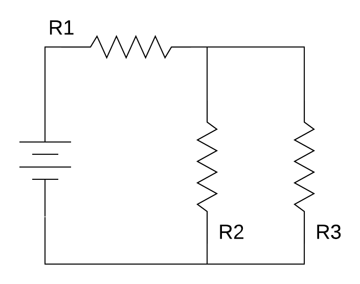
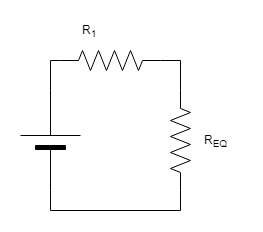
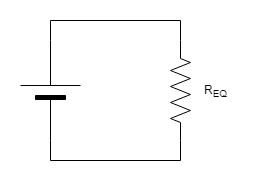
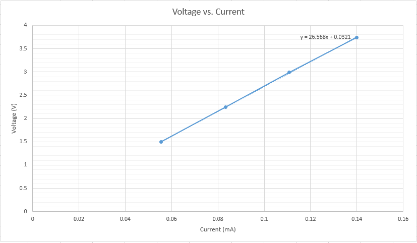

# Abstract

The purpose for this exercise was to use Ohm's law to demonstrate how current run though a circuit.  The problem was to calculate the amount of resistance within a circuit with three different resistors being used.  Each resistor had a different level of resistance.  A multimeter was used to measure the amount of current and voltage was running through each resistor and the whole circuit.

# Design Methodology
Three resistors of different resistances were used during the exercise.  Each resistance was determined from the banded reading, then were measured using a multimeter to determine the true resistance.  The resistances of each resistor of its rated resistance, rated tolerance, and the actual resistance are shown in Table 1.  

Table: *Rated Resistance, Rated Tolerance, and Actual Resistance*

|      | Rated Resistance (Ω) | Rated Tolerance (%) | Actual Resistance (Ω) |
|-----:|:--------------------:|:-------------------:|:---------------------:|
| R~1~ | 3,300                | 5                   | 3,233                 |
| R~2~ | 15,000               | 5                   | 14,590                |
| R~3~ | 27,000               | 5                   | 26,982                |

A circuit was constructed using based off the schematic shown in Figure 1.  With the circuit built, the voltages were measured across Power Supply, Resistor 1 and Resistor 2.  Voltage measurements were taken across each component from a range of 2V-5V and recorded (See Table 2).  

Table: *Voltages of the Power Supply, Resistor 1 and Resistor 2*

| V~PS~ (V) | V~R1~ (V) | V~R2~ (V) |
|:---------:|:---------:|:---------:|
| 2         | 0.5       | 1.5       |
| 2.99      | 0.75      | 2.25      |
| 3.99      | 1         | 2.99      |
| 4.99      | 1.26      | 3.74      |

After the voltages were measured, the multimeter was reconfigured to measure the current through all three resistors and was recorded (See Table 3).

Table: *Currents through Resistor 1, Resistor 2, and Resistor 3*

| I~R1~ (mA) | I~R2~ (mA) | I~R3~ (mA) |
|:----------:|:----------:|:----------:|
| 0.39       | 0.25       | 0.14       |

The equivalent resistor was calculated for the two parallel resistors using +@eq:1, then an equivalent circuit was then drawn (See Figure 2).
$$ \frac{1}{R_{EQ}} = \frac{1}{R_2} + \frac{1}{R_3} $$ {#eq:1}

The equivalent resistor for the two parallel resistors were calculated to be 9,642.86 Ω.  The total equivalent resistor for the entire circuit was calculated using +@eq:2, then a equivalent circuit was drawn for the new equivalent resistor (See Figure 3).
$$ R_{EQ} = R_1 + \frac{1}{\frac{1}{R_2} + \frac{1}{R_3}} $$ {#eq:2}

The new equivalent resistor was calculated to be 12,942.9 Ω.  Voltages were calculated based on the measured currents at 5V for the power supply, Resistor 1, Resistor 2 using +@eq:3.
$$ V = IR $$ {#eq:3}

The calculated voltages are as follows: V~PS~=5.05 V, V~R1~=1.287 V, and V~R2~=3.75 V.

# Results and Analysis

The data recorded was placed into a table (See Table 4) and using the data, a graph of the voltage vs current was created for Resistor 3 as shown in Figure 4.

Table: *Voltages of the power supply and the three resistors and the current for each resistor*

| V~PS~ (V) | V~R1~ (V) | V~R2~ (V) | V~R3~ (V) | I~R1~ (mA)| I~R2~ (mA)| I~R3~ (mA)|
|:---------:|:---------:|:---------:|:---------:|:---------:|:---------:|:---------:|
| 2         | 0.5       | 1.5       | 1.5       | 0.16      | 0.46      | 0.06      |
| 2.99      | 0.75      | 2.25      | 2.25      | 0.23      | 0.15      | 0.08      |
| 3.99      | 1         | 2.99      | 2.99      | 0.30      | 0.20      | 0.11      |
| 4.99      | 1.26      | 3.74      | 3.74      | 0.39      | 0.25      | 0.14      |

The slope of the graph represents the resistance of Resistor 3 using +@eq:4 as the equation.
$$ \frac{V_{R3}}{I_{R3}}= \Omega_{R3} $$ {#eq:4}

The slope of the line for Resistor 3 was able to approximate the true value of the resistor with a percent error of 1.53%.

# Conclusion

Ohm’s Law proves that the amount of voltage is proportional to the amount of current running through the circuit. Using a breadboard with a simple parallel circuit with the multimeter. It allows for easy measurement of each value of the resistors, the voltage, and the current of the circuit. As a result, Figure 2 shows that the more voltage put into the circuit the stronger the current becomes. When the voltage was lower the current was proportionally lower. When one was raised the other raised with it. The exercise proved successful in showing how current and voltage are proportional due to Ohm’s Law